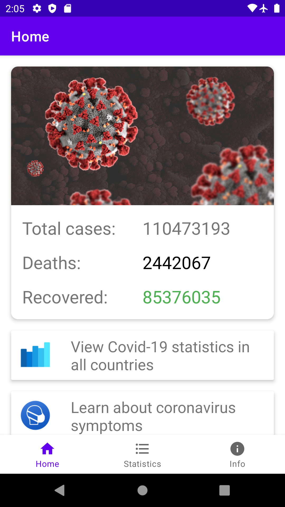
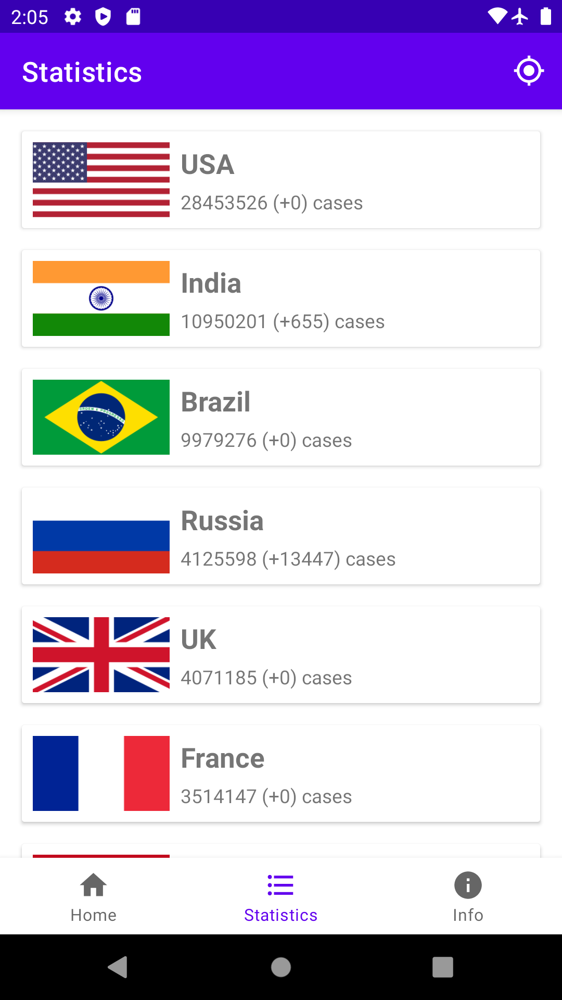
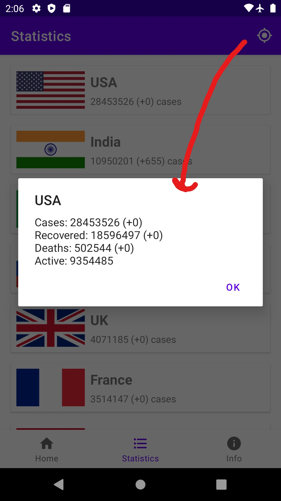
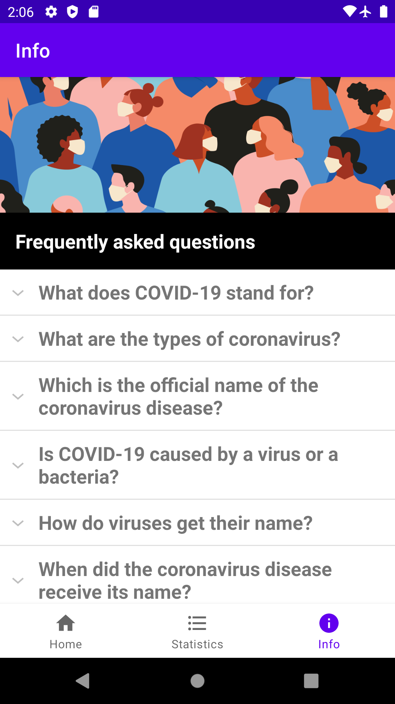

# Covid Helper App
Covid Helper is an Android app that helps people to see the latest Covid-19 statistics and know more about it. It's a Capstone project of the Android Kotlin Developer Nanodegree course.

